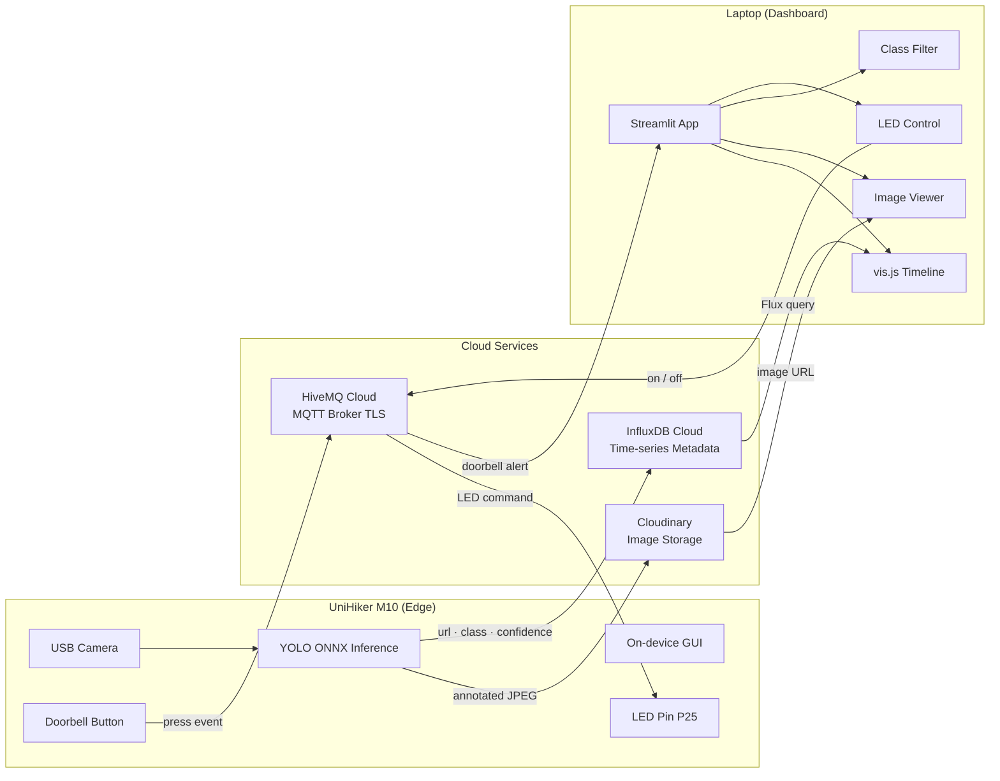

# Smart Doorbell

An end-to-end IoT smart doorbell system spanning edge inference, cloud storage, time-series data, and a real-time web dashboard.

## Demo

[](https://youtube.com/shorts/g99llM1LRGQ?feature=share)

## Architecture



Both nodes only need outbound Internet access and do not need to share a LAN.

## Features

- **On-device inference** — YOLOv8n ONNX model runs entirely on the UniHiker M10 CPU; no cloud GPU required
- **Threaded upload pipeline** — background worker queue decouples fast inference from slow network I/O so the detection loop never stalls
- **Configurable cooldown** — `COOLDOWN_SEC` gates uploads to prevent duplicate frames from the same scene
- **Bidirectional MQTT over TLS** — device publishes doorbell press events; dashboard publishes LED on/off commands back
- **Real-time dashboard** — auto-refreshes every 1.5 s; clicking a timeline item loads the annotated image inline
- **Multi-class filter** — multiselect widget dynamically populates from live InfluxDB data and filters the vis.js timeline

## Tech Stack

| Layer | Technology |
|-------|-----------|
| Edge hardware | UniHiker M10 (ARM Cortex-A35) |
| Object detection | YOLOv8n · ONNX Runtime |
| Image storage | Cloudinary |
| Time-series DB | InfluxDB Cloud · Flux |
| Messaging | HiveMQ Cloud · MQTT over TLS |
| Dashboard | Streamlit · streamlit-timeline (vis.js) |
| Camera | OpenCV · threaded frame reader |

## Repository Layout

```
doorbell_assignment/
├── unihiker/
│   ├── doorbell_unihiker.py         # Edge runtime: detection loop, upload queue, MQTT, GUI
│   ├── utils.py                     # CameraReader, letterbox, YOLO pre/post-processing
│   ├── device_config.example.py     # Credential template — copy to device_config.py
│   ├── requirements.txt
│   └── yolo25n.onnx                 # YOLOv8n ONNX weights
└── dashboard/
    ├── app.py                       # Streamlit dashboard
    ├── mqtt_listener.py             # Standalone MQTT → events.json bridge
    ├── events_store.py              # Thread-safe + file-locked event store
    ├── dashboard_config.example.py  # Credential template — copy to dashboard_config.py
    └── requirements.txt
```

## Setup

### 1. Configure credentials

```bash
cp unihiker/device_config.example.py unihiker/device_config.py
cp dashboard/dashboard_config.example.py dashboard/dashboard_config.py
```

Edit both files and fill in your Cloudinary, InfluxDB, and HiveMQ credentials.

### 2. Install dependencies

**On the UniHiker:**
```bash
pip install -r unihiker/requirements.txt
# pinpong and unihiker packages are pre-installed on the device
```

**On the laptop:**
```bash
pip install -r dashboard/requirements.txt
# Linux only — chime requires ALSA dev libs:
# sudo apt install libasound2-dev
```

### 3. Run

```bash
# Laptop — terminal 1
streamlit run dashboard/app.py

# UniHiker
python unihiker/doorbell_unihiker.py
```

> `mqtt_listener.py` is an optional standalone MQTT bridge. Do not run it alongside `app.py` as both subscribe to `doorbell/press` and would write duplicate events.

## Data Contracts

**MQTT topics**

| Topic | Direction | Payload |
|-------|-----------|---------|
| `doorbell/press` | Device → Dashboard | `{"id": "<uuid>", "ts": "<ISO8601Z>"}` |
| `doorbell/led` | Dashboard → Device | `{"state": "on"}` / `{"state": "off"}` |

**InfluxDB measurement: `doorbell_detection`**

| Key | Type | Notes |
|-----|------|-------|
| `device` | tag | e.g. `unihiker_m10` |
| `top_class` | tag | COCO class name, used for filtering |
| `url` | field (str) | Cloudinary `secure_url` |
| `count` | field (int) | number of detections in frame |
| `confidence` | field (float) | top box score 0.0–1.0 |
